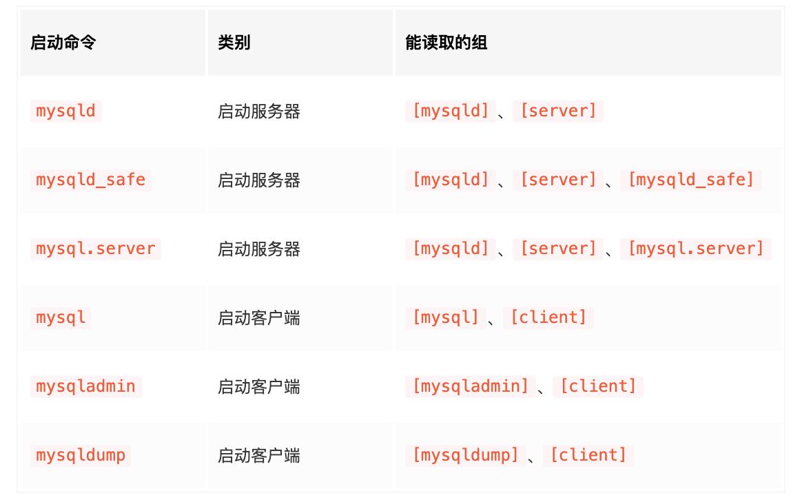

# 配置选项、系统变量
## 配置路径
```
# 有多个路径，一般是如下
/etc/my.cnf
/etc/mysql/my.cnf

# 额外的加载路径
defaults-extra-file

# 也可以在启动时指定特定加载路径
mysqld --defaults-file=/tmp/myconfig.txt
```

## 优先级
```
# 不同配置文件，则按照官方给定的顺序来加载
# 同个配置文件内，同个选项则按照最后的来
# 配置文件中，能读的组有如下图
```


## 查看系统变量
```
# 默认是session
# session是指当前会话
show variables likes "xxx"

# 这是GLOBAL
show GLOBAL variables likes "xxx"
```

## 设置系统变量
```
# 默认是session
set xxx = bbb

# 这是GLOBAL
set GLOBAL xxx = bbb
```

## 查看状态变量
```
# 比如查看系统当前的连接数
show status likes "%thread%";

# 默认是session
show status likes "xxx"

# 这是GLOBAL
show GLOBAL status likes "xxx"
```
