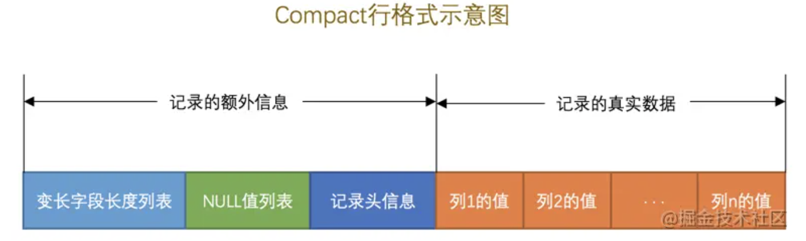
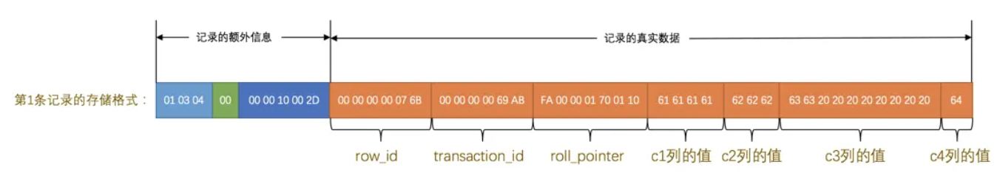

# innodb记录结构
## 页
页是mysql磁盘和内存交互的基本单位，也是mysql管理和存储的基本单位，页大小为16k。

也就是说每次至少读取和写入16k。

## 行格式
```
ROW_FORMAT分为4种：
1. compact
2. dynamic 5.7的格式，和compact差不多，只是溢出列处理方式为直接存放地址，并指向其他页
3. compressed 压缩格式
4. redundant 旧格式，忽略
```

## 指定行格式
```
# 创建表时，指定行格式
create table t1 (
    name varchar(65533) NOT NULL
) character set ascii ROW_FORMAT=COMPACT; 
```

## COMPACT行格式
```
分为2部分
1. 记录的额外信息
2. 记录的真实信息
```


## 记录的额外信息
```
1. 变长字段长度列表：2字节
2. NULL值列表：1字节
3. 记录头信息：5字节
```
记录头信息


## 记录的真实信息
```
隐藏列信息，分3个：
1. DB_ROW_ID 行唯一标识，如果没设置主键，则有，6字节
2. DB_TRX_ID 事务id，6字节
3. DB_ROLL_PTR 回滚指针，7字节

数据内容

```
一条记录信息


## VARCHAR(M)
```
由于变长字段长度列表为2字节，此信息决定了mysql每一行数据中，最大支持65532字节(65535-变长字段长度占2字节-NULL值占1字节=65532。M表示的是字符数量，不是字节数量，而mysql最小的字符ascii占用1字节，所以在NOT NULL的情况下，最大是有65533个字符)
```

## 行溢出
```
# 由于页的大小为16k，而每一行数据中，可变长列的最大也有65533字节，所以肯定会出现行溢出。当出现行溢出时，COMPACT会将部分数据放到行内，而另外部分会放到另外一页，且在当前行会有一个地址指向那一页。
# 刚好可以创建，因为 65529+4 = 65533
create table t1 (
    name varchar(65529) NOT NULL
    age int,
) character set ascii ROW_FORMAT=COMPACT; 
```
