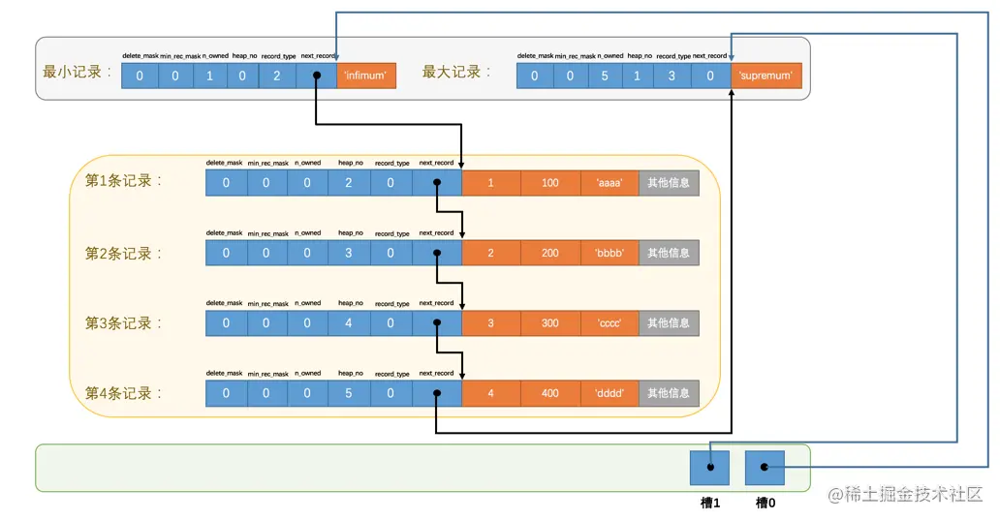
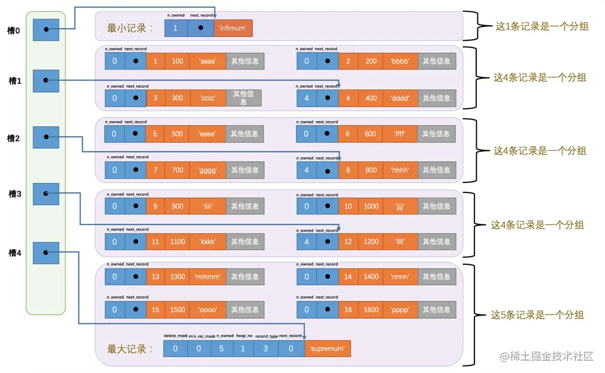
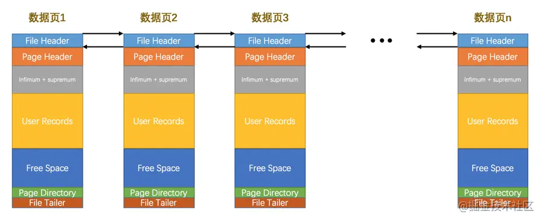

# innodb数据页结构

## 数据页
数据页也就是索引页，即存放记录的页。

## 数据页结构
```
一个数据页可以被大致划分为7个部分
1. File Header，表示页的一些通用信息，比如当前页的页号(页的唯一标识)、上一个页号、下一个页号(所有的数据页会形成一个双向链表)、校验和、页的类型等。

2. Page Header，表示数据页专有的一些信息，比如有多少条记录、上一条记录插入的位置、索引ID、修改页最大的事务ID等。

3. Infimum + Supremum，两个虚拟的伪记录，分别表示页中的最小和最大记录，占固定的26个字节。

4. User Records：真实存储我们插入的记录的部分，大小不固定。每条用户记录都有一个next_record，会按主键从小到大串起来形成一个单链表(即都会记录下条记录的偏移)。

5. Free Space：页中尚未使用的部分，大小不确定。

6. Page Directory：存放槽的地方。一般User Records中每4条记录就会有一个槽，每个槽指向4条记录中最大的记录，而槽的值就是记录在User Record中的偏移量。所以可用2分法，对槽2分，找到槽中指向的值，与目标值比较，直至找到目标值对应的槽，再对槽里的记录遍历定位。大小不固定，插入的记录越多，这个部分占用的空间越多。

7. File Trailer：与File Header 中的校验和比较，用于检验页是否完整，占用固定的8个字节。
```

用户记录与槽的关系1


用户记录与槽的关系2


数据页与页的关系
