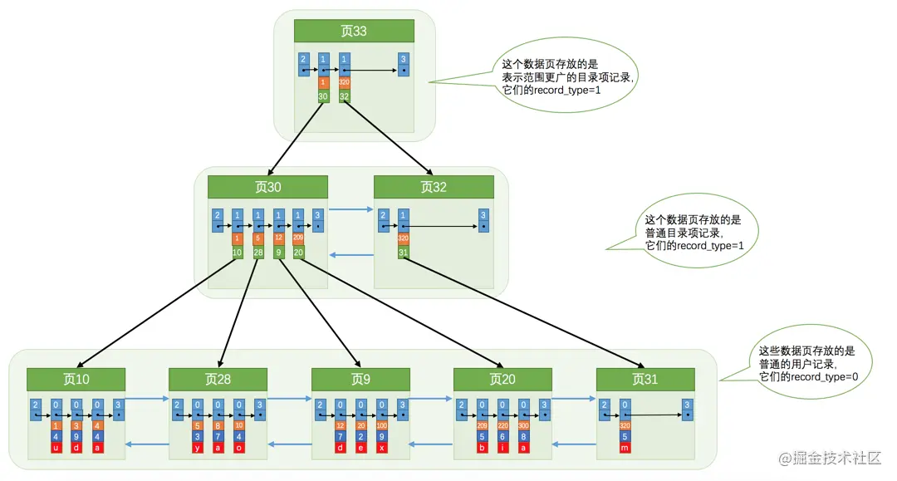
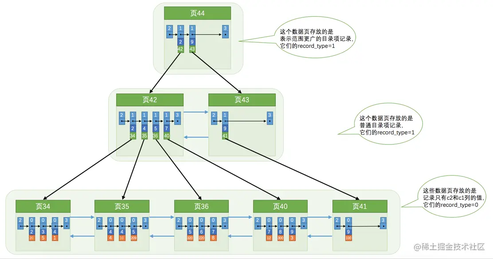

# B+树索引
原理：对被索引的列，构建索引列+页号为一条记录，多个记录也按照数据页的形式，形成目录页。

## 聚簇索引
```
# 目录页
目录页的每一条记录的结构为：主键+页号

# 数据页
数据页的每一条记录为完整的数据
```
聚簇索引


## 二级索引(辅助索引)
```
# 目录页
目录页的每一条记录的结构为：二级索引列+页号

# 数据页
数据页的每一条记录为：二级索引列+主键

注意：
二级索引在拿到主键后，需要去聚簇索引中查询，这个叫做回表
```
二级索引


## 联合索引
```
同二级索引(辅助索引)
```

## 与MySIAM的索引区别
```
# mysiam中索引和数据是分开的，即索引的叶子节点中，保存的是索引值+真实数据的行号

# innodb中聚簇索引的叶子节点，就是数据本身了

# 二者区别
查询速度上，当使用2级索引时，mysiam可直接拿到行号，比innodb的回表操作要快。
```

## 索引的根节点
```
根节点一旦定下来就不会变，即使随着数据的增多，也只是分裂页面，移动记录。
```

## B+树索引基本概念
```
1. 每个索引都对应一棵B+树，B+树分为好多层，最下边一层是叶子节点，其余的是内节点。所有用户记录都存储在B+树的叶子节点，所有目录项记录都存储在内节点。

2. InnoDB存储引擎会自动为主键（如果没有它会自动帮我们添加）建立聚簇索引，聚簇索引的叶子节点包含完整的用户记录。

3. 我们可以为自己感兴趣的列建立二级索引，二级索引的叶子节点包含的用户记录由索引列 + 主键组成，所以如果想通过二级索引来查找完整的用户记录的话，需要通过回表操作，也就是在通过二级索引找到主键值之后再到聚簇索引中查找完整的用户记录。

4. B+树中每层节点都是按照索引列值从小到大的顺序排序而组成了双向链表，而且每个页内的记录（不论是用户记录还是目录项记录）都是按照索引列的值从小到大的顺序而形成了一个单链表。如果是联合索引的话，则页面和记录先按照联合索引前边的列排序，如果该列值相同，再按照联合索引后边的列排序。

5. 通过索引查找记录是从B+树的根节点开始，一层一层向下搜索。由于每个页面都按照索引列的值建立了Page Directory（页目录），所以在这些页面中的查找非常快。
```

## 常用索引技巧
```
# 查看表的索引信息
show index from tbl;

# 重新统计表的索引信息
analyze table tbl;
```


